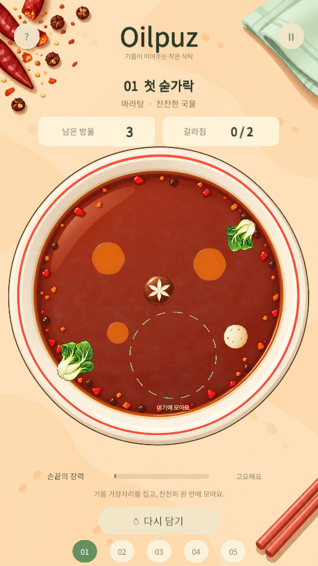

# Oilpuz — 마라탕

기름을 집은 부분이 먼저 움직이고 뒤가 늘어지며 따라오는, 세로형 모바일 유체 퍼즐 프로토타입입니다.

## Android 프로토타입 0.2.0

[APK 다운로드](https://github.com/kimjunho403/OilPuzzle/releases/download/v0.2.0/Oilpuz-v0.2.0-arm64.apk) · [릴리스와 변경 내용](https://github.com/kimjunho403/OilPuzzle/releases/tag/v0.2.0)

Android 6.0 이상, ARM64, OpenGL ES 3 기기용입니다. 휴대폰에서 APK를 내려받아 해당 브라우저/파일 앱의 앱 설치 권한을 허용하고 설치합니다. 프로토타입은 개발용 키로 서명했으며 스토어 배포용이 아닙니다. 연결된 휴대폰이 없어 실제 터치·발열·성능은 아직 검증하지 못했습니다.

기름 연결이 유동적으로 바뀌도록 하고 탄성 반동을 줄였습니다. 표면은 얇고 반투명한 막으로 바꾸고, 마라탕 이미지 다섯 장을 캐주얼 일러스트로 다시 생성했습니다. [변경 기록](Docs/Changes-v0.2.md) · [이미지 생성 프롬프트](Docs/Art/Casual-v02-prompts.md)

## 열기

1. Unity Hub에서 이 폴더를 **Unity 6000.1.9f1**로 엽니다.
2. `Assets/Oilpuz/Scenes/MalaPuzzle.unity`를 엽니다.
3. Game 화면을 **9:16 / 540×960**으로 두고 Play를 누릅니다.

씬에는 아트와 UI가 미리 배치되어 있습니다. Play를 누르면 런타임 기름 렌더러와 입력이 연결됩니다. 원래 `Assets/Scenes/SampleScene.unity`는 보존되어 있습니다.

## 조작

- 기름의 가운데나 가장자리를 누른 채 천천히 드래그합니다. 누른 물질을 유지한 채 끌어당깁니다.
- 장력이 높으면 목 부분이 끊어지고 갈라짐 횟수가 증가합니다.
- 모든 기름을 하나로 연결하고 초록 원에 완전히 넣은 뒤 손을 놓습니다.
- 재료는 장애물입니다. 후반의 좁은 문은 작은 방울을 먼저 운반해야 통과할 수 있습니다.
- 갈라짐 한도는 스테이지별 2 / 2 / 1 / 1 / 0회입니다.
- 상단 `?`는 도움말, `Ⅱ`는 일시정지, 아래 `다시 담기`는 재시작입니다. 하단 숫자로 스테이지를 바꿉니다.
- 마우스와 Unity Input System의 터치를 지원합니다.

## 문서

- `CONTEXT.md`: 이전 대화의 결정과 현재 작업 기준.
- `Docs/GameDesign.md`: 게임 기획서 및 손맛 설계.
- `Docs/Art/Concepts/Mala-Target-v01.png`: 이미지 생성으로 만든 예상 화면. 실제 실행 캡처와 다릅니다.
- `Docs/Art/AssetManifest.md`: 예상 화면을 보고 정리한 에셋 목록.
- `Docs/Art/*.prompt.txt`: 실제 이미지 생성 프롬프트.
- `Docs/Validation.md`: 수행한 검증과 남은 한계.

## 에셋과 코드

- `Assets/Oilpuz/Art/Mala`: 직접 생성한 식탁·그릇·표고버섯·완자·청경채 PNG.
- `Assets/Oilpuz/Data/Mala.asset`: 스킨. 재료 스프라이트와 기름·UI 색을 교체합니다.
- `Assets/Oilpuz/Data/Stage*.asset`: 퍼즐 규칙과 배치. 스킨과 독립적입니다.
- `Assets/Oilpuz/Scripts/OilSimulation.cs`: 입자 연결, 국소 드래그, 점성, 합체·분열, 충돌, 목표 판정.
- `Assets/Oilpuz/Scripts/OilRenderer.cs` 및 `Shaders`: 밀도 누적과 기름 표면 렌더링.
- `Assets/Oilpuz/Fonts`: Noto Sans CJK KR. SIL Open Font License 포함.

짬뽕·라멘은 `Create > Oilpuz > Soup Skin`으로 새 스킨을 만들어 이미지와 색을 연결하는 방식으로 확장합니다. 현재 완성된 스킨은 마라탕 하나입니다.

## 개발 도구

Unity 메뉴 `Oilpuz`:

- **Build or refresh mala scene**: 기본 스킨·5단계·게임 씬을 구성합니다. 기본 Stage 데이터와 MalaPuzzle 씬을 다시 작성하므로 레벨을 직접 수정한 뒤에는 필요할 때만 사용하세요.
- **Validate simulation and assets**: 실제 C# 시뮬레이션 검증 결과를 `Docs/Validation-results.txt`에 기록합니다.
- **Build Windows preview**: `Builds/Windows/Oilpuz.exe`를 만듭니다.
- **Build Android APK**: `Builds/Android/Oilpuz-v0.2.0-arm64.apk`를 만듭니다. Unity Android Build Support, SDK, NDK, OpenJDK가 필요합니다.

게임용 입자 근사 모델이며 정밀한 액체 해석은 아닙니다. 물리 수치와 새 단계 난이도는 실플레이로 더 조정해야 합니다. 모바일 실기기 성능과 iOS 패키징은 별도 검증 대상입니다. Unity 캐시·로그·빌드·APK·서명 키는 `.gitignore`로 제외하고, APK는 GitHub 릴리스 첨부로 배포합니다.
